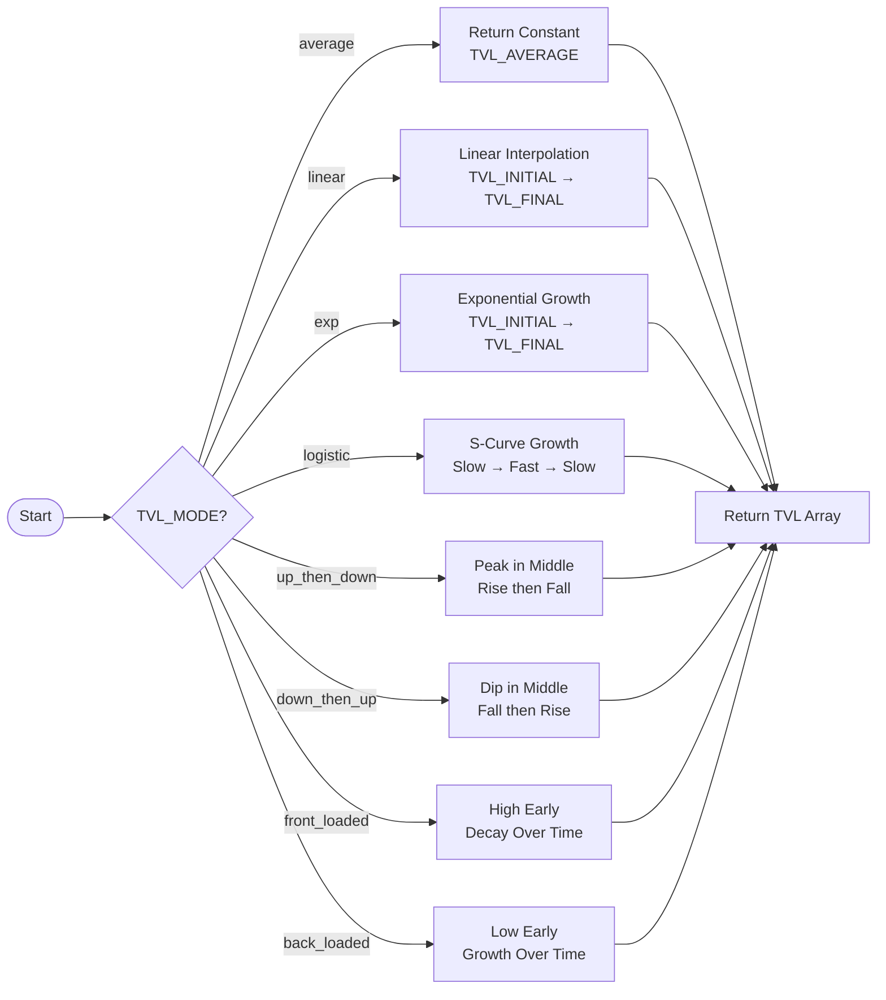
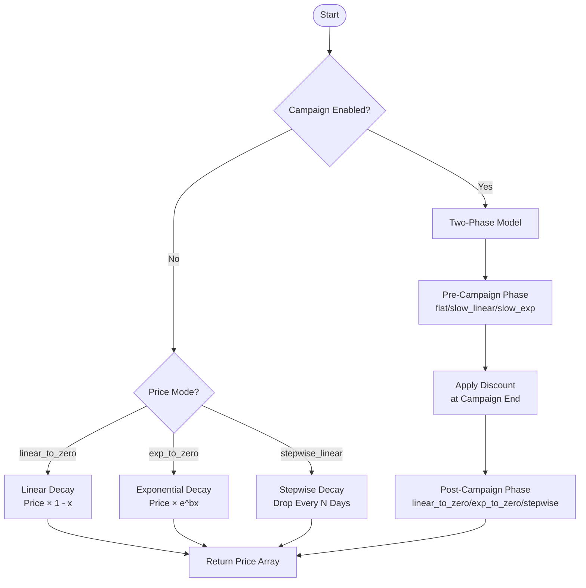
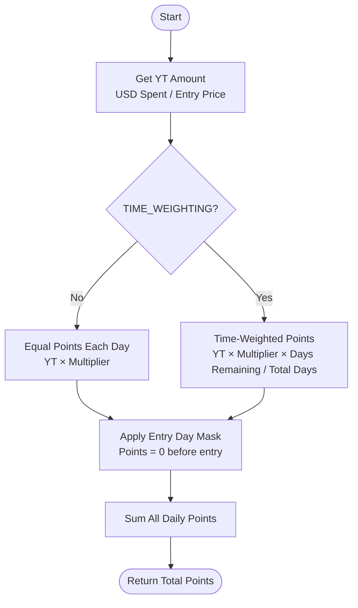

# Pendle YT Airdrop Calculator - Flowchart

This flowchart shows how the calculator works step by step.

## Main Program Flow

```mermaid
flowchart TD
    Start([Start Program]) --> LoadConfig[Load Configuration<br/>- Airdrop %<br/>- TVL Settings<br/>- YT Token Holdings<br/>- Multipliers]
    
    LoadConfig --> RunSim[Run Airdrop Simulation]
    
    RunSim --> BuildTVL[Build Protocol TVL Path Over Time<br/>Starts from Day 0<br/>Based on TVL_MODE]
    
    BuildTVL --> CheckPendleMode{PENDLE_MODE?}
    
    CheckPendleMode -->|simple| BuildPendleShare[Build Pendle Share Path<br/>Starts from Day 0<br/>Calculate Network Multiplier]
    CheckPendleMode -->|by_tokens| CalcTokenMultipliers[Calculate Multipliers<br/>Per Token Type]
    
    BuildPendleShare --> CalcNetworkPoints[Calculate Daily Network Points<br/>TVL × Multiplier]
    CalcTokenMultipliers --> CalcNetworkPoints
    
    CalcNetworkPoints --> ProcessYT[Process Each YT Token Position]
    
    ProcessYT --> BuildYTPrice[Build YT Price Path<br/>Based on Price Mode]
    
    BuildYTPrice --> CheckCampaign{Campaign Enabled?}
    
    CheckCampaign -->|Yes| TwoPhasePrice[Two-Phase Price Model<br/>- Flat/Slow before campaign end<br/>- Drop + Decay after]
    CheckCampaign -->|No| SinglePhasePrice[Single Phase Price Model<br/>- Linear/Exp/Stepwise decay]
    
    TwoPhasePrice --> CalcEntry[Calculate Entry Price<br/>& YT Amount Purchased]
    SinglePhasePrice --> CalcEntry
    
    CalcEntry --> CalcUserPoints[Calculate User Points Daily<br/>YT Amount × Multiplier × Time Weight]
    
    CalcUserPoints --> SumPoints[Sum All User Points<br/>Across All Positions]
    
    SumPoints --> CalcShare[Calculate User Share<br/>User Points / Network Points]
    
    CalcShare --> CalcAirdrop[Calculate Airdrop Tokens<br/>Total Airdrop × User Share]
    
    CalcAirdrop --> CalcValues[Calculate Airdrop Value<br/>at Different FDVs]
    
    CalcValues --> DisplayResults[Display Results<br/>- User Share<br/>- Tokens Received<br/>- ROI at Each FDV]
    
    DisplayResults --> CheckTiming{RUN_TIMING_SWEEP?}
    
    CheckTiming -->|No| End([End])
    CheckTiming -->|Yes| RunTimingSweep[Run Timing Sweep]
    
    RunTimingSweep --> TestEachDay[For Each Entry Day 0-79]
    
    TestEachDay --> CalcROIForDay[Calculate ROI<br/>for This Entry Day]
    
    CalcROIForDay --> FindBestDays[Find Best Entry Days<br/>by ROI for Each FDV]
    
    FindBestDays --> DisplayTiming[Display Top 5 Entry Days<br/>for Each FDV]
    
    DisplayTiming --> End
```



## Detailed Calculation Flow

### TVL Path Building


### YT Price Path Building


### Points Calculation


### Network Points Calculation
```mermaid
flowchart TD
    Start([Start]) --> CheckProvided{NETWORK_POINTS_TOTAL<br/>Provided?}
    
    CheckProvided -->|Yes| UseDirect[Use NETWORK_POINTS_TOTAL<br/>Directly]
    CheckProvided -->|No| CheckMode{PENDLE_MODE?}
    
    CheckMode -->|simple| SimpleMode[Simple Mode<br/>Use when you only have<br/>overall Pendle share %]
    CheckMode -->|by_tokens| TokenMode[By Tokens Mode<br/>Use when you have<br/>detailed token breakdowns]
    
    SimpleMode --> CalcPendleShare[Calculate Pendle Share Path<br/>Over Time<br/>Starts from Day 0]
    
    CalcPendleShare --> CalcNetMult[For Each Day:<br/>Pendle Share × Pendle Mult +<br/>(1 - Pendle Share) × Direct Mult]
    CalcNetMult --> CalcDaily[Daily Network Points =<br/>TVL × Network Multiplier]
    
    TokenMode --> LoopTokens[For Each Token in TOKEN_CONFIGS]
    
    LoopTokens --> GetTVLs[Get TVL_YT_Pendle and TVL_direct<br/>Get mult_yt_pendle and mult_direct]
    GetTVLs --> CalcFullPoints[Full Points =<br/>TVL_YT_Pendle × mult_yt_pendle +<br/>TVL_direct × mult_direct]
    CalcFullPoints --> MoreTokens{More Tokens?}
    MoreTokens -->|Yes| LoopTokens
    MoreTokens -->|No| CalcDailyPoints[For Each Day:<br/>Use Full Points<br/>(Pendle markets available from Day 0)]
    CalcDailyPoints --> ScaleByTVL[Scale by TVL Path:<br/>Points = TVL/Avg_TVL × Base Points]
    ScaleByTVL --> CalcDaily
    
    CalcDaily --> SumNetwork[Sum All Daily Network Points]
    UseDirect --> SumNetwork
    SumNetwork --> Return([Return Total Network Points])
```

## Key Formulas

### User Share Calculation
```
User Share = Total User Points / Total Network Points
```

### Airdrop Allocation
```
Airdrop Tokens = Total Supply × Airdrop Percentage × User Share
```

### ROI Calculation
```
Token Price = FDV / Total Supply
Airdrop Value = Airdrop Tokens × Token Price
ROI = (Airdrop Value - Total Spent) / Total Spent × 100%
```

### Time Weighting (if enabled)
```
Weight for Day D = (Total Days - D) / Total Days
Points for Day D = YT Amount × Multiplier × Weight
```

## Data Flow Summary

1. **Configuration** → Loads all settings from top of file
2. **TVL Path** → Generates TVL values for each day
3. **Network Points** → Calculates total points network earns
4. **YT Price Path** → Generates YT price for each day
5. **User Points** → Calculates points you earn based on holdings
6. **User Share** → Your points / Network points
7. **Airdrop Tokens** → Your share of total airdrop
8. **ROI** → Value at different FDVs vs. cost

